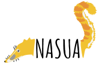

# Preambulo

## Quien soy?

Gabriel Muñoz 

- Biólogo
- Ecólogo Computacional 

Consultor en Datos 
*Biodiversidad y Geoespaciales*

Coordinador General 



## Charla introductoria 

https://github.com/fgabriel1891/ManejoHabilDatosMediaLab 

## Material para este taller 

https://github.com/fgabriel1891/ManejoHabilDatosWorkshop


# Como organizar datos en las hojas de cálculo?
## Una Variable, Una Columna!!!!


## Control de Calidad 

### Como asegurar la calidad de nuestros datos? 

<div id="left">

- Errores de tipeo 

- Discrepancias 

- Fueras de lugar

- Errores de formato

- Irregularidades

- Datos faltantes

</div>

<div id="right">

- Contradicciones

- Duplicaciones

- Fueras de rango 

- Incongruencias

- Multiples valores
</div>

## Google Open Refine 

http://openrefine.org/download.html

*******
[tidyverse](https://www.tidyverse.org/)

## Exportar datos
 
Como exportar hojas de cálculo?

- Registros similares en un dataset

- Seguir standards internacionales en unidades y formatos (e.g. yyyy-mm-dd)

- Se consistente (e.g. Mts, (m), metros)

- Preserva en formatos estables (.csv, .txt, .tsv)

# Análisis y visualización de datos en R


## Intro a R 


R version 3.4.4 (Someone to Lean On) 

- https://www.r-project.org/

RStudio Desktop 1.1.442

- https://www.rstudio.com/products/rstudio/download/

## Que es R?

- Software gratis y abierto para el computación estadística y graficos. 

- Lenguaje de programación 

## Crear un proyecto 

Un proyecto, una carpeta! 


## Empezar un script 

## Buenas prácticas de programación 

## Vectores 

```{r, eval=T}

# Numericos 
num = c(2,4,5,6,7,5)
num
# Logicos 

tOf = c(TRUE, FALSE, T,T, F)
tOf

# texto (strings)

text = c("a","b","c","d")
text 

# Examinar: 
length(text)

# Combinar 
comb = c(num ,tOf, text)
comb # Numeros a texto 

```
## Vectores

### Variables

```{r, eval = T}

# "<-" asigna un valor a la variable 
x <- 3 

# "=" tambien asigna un valor a la variable 
y = 4

# Operaciones aritmeticas
z = x + y
z

w = ((x^2) + (y^2))/z 
w
```

## Vectores

### Indices []

```{r}
text
text[3]
text[-3]
text[c(1,3)]
text[c(4,3,2,1)]
text[c(1:3)]

tOf
text[tOf]

```

## Vectores

### Nombres 

```{r}

nombres = c("Michelle", "Diana", "Gabriel", "Horacio","Pablo")

names(num)
names(num) = nombres
num

names(num) = c(nombres,"Sara")
num

num["Diana"]
num[c("Diana","Gabriel")]
```

## Mas tipos de objetos en R 

###  Matrix 

```{r}
matrix1 = matrix(c(1,2,3,4, 5,6,7,8), nrow = 2,ncol = 4)
matrix1
str(matrix1)

matrix2 = matrix(c(11,12,13,14,15,16,17,18), 2 , 4)
matrix2
```

## Mas tipos de objetos en R 

###  Unir matrices 

```{r}
# por columna 
cbind(matrix1, matrix2)

#por fila
rbind(matrix1, matrix2)
```

## Mas tipos de objetos en R 

### Lista

```{r}
lista = list(text, num, tOf)
lista


```
## Mas tipos de objetos en R 

### Lista

```{r}

lista[[2]]
lista[[2]][3]

lista[[2]][3] = 4
lista[[2]]

```
## Mas tipos de objetos en R 

###  Lista con nombres (named list)

```{r}
lista = list("letras" = text,  "numeros"= num, "opLogicos" = tOf)
lista

lista$letras
```

## Mas tipos de objetos en R 

###  Lista con nombres (named list)

```{r}

lista$letras[2]

lista[c("numeros", "opLogicos")]
```

## Mas tipos de objetos en R 

###  Data Frame 

```{r, error=T}
# Lista de vectores del mismo tamaño 
data.frame(text, num, tOf)
```

```{r}
# install.packages("datasets")
library(datasets)
str(datasets::beaver1)
data2play = datasets::beaver1

data2play[1]
data2play[,1]
data2play[1,]
data2play$day
data2play["day"]
```


## Importar datos a R 


```{r, eval=F}

# subir csv file to R. 

dataset = read.csv(file = "data/dataset.csv", header = T)

# examinar dataset  
head(dataset)
tail(dataset)

str(dataset)
```

## Objectos 

```{r}
# Objeto 
num

```

## Funciones

```{r}
# Funciones 
# functionNombre = function(argumentos) { 
  # codigo operacion , 
  # resultado }


sueldoMes = function(lista, sueldo){
  saldoFinal = lista + sueldo
  return(saldoFinal)
}

sueldoMes(num, 0.14)
mes1 = c(0.15,0.13,0.16,0.14,0.3,0.23)

sueldoMes(num, mes1)
```

## loops 

```{r}
mes2 = c()

 for ( i in 1:length(num)){  
  mes2[i] = num[i] + 0.43
  names(mes2)[i]  = names(num)[i]
}

mes2
```

## sapply / lapply

```{r}

# sapply
sapply(num, function(x) x + 0.13)

# lapply
lapply(num, function(x) x + 0.13)
```

## Exploración de datos 

### summary(), dim()
```{r}
summary(data2play)
dim(data2play)
```
## Exploración de datos 

### aggregate()

```{r}
aggregate(time~day, mean, data =data2play)
aggregate(temp~day, max, data =data2play)
aggregate(temp~day, min, data =data2play)
```

## Exploración de datos 

### melt()

```{r}
meltData =reshape::melt(data2play)
meltData

# factores
unique(meltData$variable)
```


## Visualización de datos en R 
```{r,out.width="54%" , eval = F}
par(mfrow = c(1,2))
plot(activ~temp, data = data2play)
plot(data2play$activ~data2play$time)
```


## Visualización de datos en R 
```{r,out.width="54%" , echo = F}
par(mfrow = c(1,2))
plot(activ~temp, data = data2play)
plot(data2play$activ~data2play$time)
```

## Plots base 

### Histograms

```{r, out.width="50%"}
hist(data2play$temp, breaks = 10)
```


## Plots base 

### Boxplot 

```{r, out.width="60%", eval = F}
data2play2 = datasets::beaver2

boxplot(data2play2$temp, data2play$temp, 
        xlab  = "Castores", ylab = "T (ºc)",
        main = "Diferencia de temperatura entre especies de castor")

legend("bottomleft", " T = ªC")
```

## Plots base 

### Boxplot 

```{r, out.width="60%", echo = F}
data2play2 = datasets::beaver2

boxplot(data2play2$temp, data2play$temp, 
        xlab  = "Castores", ylab = "T (ºc)",
        main = "Diferencia de temperatura entre especies de castor")

legend("bottomleft", " T = ªC")
```

## Plots base 

### Scatterplot

```{r, out.width="60%", eval = F}

plot(data2play$temp~data2play$time,
     xlab = "Hora del día",
     ylab = "Temperatura", 
     ylim = c(35,39))
points(data2play2$temp~data2play2$time,
       pch = 16, 
       col = "red")
abline(h = mean(data2play$temp))
abline(h = mean(data2play2$temp), col = "red")
legend("bottomleft", c("Species1", "Species2"),
       pch =  c(1,16), col = c("black", "red"), bty =  "n")
```

## Plots base 

### Scatterplot

```{r, out.width="60%", echo = F}

plot(data2play$temp~data2play$time,
     xlab = "Hora del día",
     ylab = "Temperatura", 
     ylim = c(35,39))
points(data2play2$temp~data2play2$time,
       pch = 16, 
       col = "red")
abline(h = mean(data2play$temp))
abline(h = mean(data2play2$temp), col = "red")
legend("bottomleft", c("Species1", "Species2"),
       pch =  c(1,16), col = c("black", "red"), bty =  "n")
```

## Colores

- http://colorbrewer2.org/

- http://tools.medialab.sciences-po.fr/iwanthue/

## Colores

```{r, out.width="60%", eval = F}
par(las = 1)
col = c("#8da54f", "#bb5542")
plot(data2play$temp~data2play$time,
     xlab = "Hora del día",
     ylab = "Temperatura", 
     ylim = c(35,39),
     col = col[1],
     pch = 16)
points(data2play2$temp~data2play2$time,
       pch = 16, 
       col = col[2])
abline(h = mean(data2play$temp))
abline(h = mean(data2play2$temp), col = "red")
legend("bottomleft", c("Species1", "Species2"),
       pch =  c(16,16), col = col , bty =  "n")
legend("bottomright", c("x_Species1", "x_Species2"),lty = 1,
       col = col , bty =  "n")
```
## Colores

```{r, out.width="60%", echo = F}
par(las = 1)
col = c("#8da54f", "#bb5542")
plot(data2play$temp~data2play$time,
     xlab = "Hora del día",
     ylab = "Temperatura", 
     ylim = c(35,39),
     col = col[1],
     pch = 16)
points(data2play2$temp~data2play2$time,
       pch = 16, 
       col = col[2])
abline(h = mean(data2play$temp))
abline(h = mean(data2play2$temp), col = "red")
legend("bottomleft", c("Species1", "Species2"),
       pch =  c(16,16), col = col , bty =  "n")
legend("bottomright", c("x_Species1", "x_Species2"),lty = 1, col = col , bty =  "n")
```

## Plots base 

- ?plot
- ?legend
- help(abline)
- ?par

## Layout 


```{r, eval = FALSE}
layout(matrix(c(1,2,3,3),2, 2, byrow  = T))
par(mar = c(4,4,2,2), las = 1)
boxplot(data2play$temp, data2play2$temp, 
        xlab = "Castores ", 
        ylab = "temperatura",
        col = col )

hist(data2play2$day, xlim = c(300,360),
     xlab = "dia")
hist(data2play$day, add = T)
plot(data2play$temp~data2play$time,
     xlab = "Hora del día",
     ylab = "Temperatura", 
     ylim = c(35,39),
     col = col[1],
     pch = 16)
points(data2play2$temp~data2play2$time,
       pch = 16, 
       col = col[2])
abline(h = mean(data2play$temp))
abline(h = mean(data2play2$temp), col = "red")
legend("bottomleft", c("Species1", "Species2"),
       pch =  c(16,16), col = col , bty =  "n")
legend("bottomright", c("x_Species1", "x_Species2"),lty = 1, col = col , bty =  "n")

```

## Layout 

```{r, echo = FALSE}
layout(matrix(c(1,2,3,3),2, 2, byrow  = T))
par(mar = c(4,4,2,2), las = 1)
boxplot(data2play$temp[data2play$activ == 0 ], data2play2$temp[data2play2$activ == 0 ], 
        xlab = "Actividad =  0 ", 
        ylab = "temperatura",
        col = col, 
        ylim = c(36,39))

boxplot(data2play$temp[data2play$activ == 1 ], data2play2$temp[data2play2$activ == 1 ], 
        xlab = "Actividad = 1 ", 
        ylab = "temperatura",
        col = col ,
        ylim = c(36,39))
plot(data2play$temp~data2play$time,
     xlab = "Hora del día",
     ylab = "Temperatura", 
     ylim = c(35,39),
     col = col[1],
     pch = 16,
     xaxt = "n")
axis(1, seq(0,2400, by = 100), seq(0:24))
points(data2play2$temp~data2play2$time,
       pch = 16, 
       col = col[2])
abline(h = mean(data2play$temp))
abline(h = mean(data2play2$temp), col = "red")
legend("bottomleft", c("Species1", "Species2"),
       pch =  c(16,16), col = col , bty =  "n")
legend("bottomright", c("x_Species1", "x_Species2"),lty = 1, col = col , bty =  "n")

```

```{r}
# Add boxplots to a scatterplot
par(fig=c(0,0.8,0,0.8))
plot(data2play$temp~data2play$time,
     xlab = "Hora del día",
     ylab = "Temperatura", 
     ylim = c(35,39),
     col = col[1],
     pch = 16)
points(data2play2$temp~data2play2$time,
       pch = 16, 
       col = col[2])
abline(h = mean(data2play$temp))
abline(h = mean(data2play2$temp), col = "red")
legend("bottomleft", c("Species1", "Species2"),
       pch =  c(16,16), col = col , bty =  "n")
par(fig=c(0,0.8,0.55,1), new=TRUE)
boxplot(data2play$time, data2play2$time, 
        col = col ,
        yaxt = "n",
        axes = F, horizontal = T)
par(fig=c(0.65,1,0,0.8),new=TRUE)
boxplot(data2play$temp, data2play2$temp, 
        col = col ,
        yaxt = "n",
        axes = F)
```


## Exportar figuras


```{r}
  res = 200 
  width = 1500
  height = 1200
  units = "px"
 
png(filename = "figs/figura1.png", res = res, width = width, height = height, units = units)


layout(matrix(c(1,2,3,3),2, 2, byrow  = T))
par(mar = c(4,4,2,2), las = 1)
boxplot(data2play$temp, data2play2$temp, 
        xlab = "Castores ", 
        ylab = "temperatura",
        col = col )

hist(data2play2$day, xlim = c(300,360),
     xlab = "dia")
hist(data2play$day, add = T)
plot(data2play$temp~data2play$time,
     xlab = "Hora del día",
     ylab = "Temperatura", 
     ylim = c(35,39),
     col = col[1],
     pch = 16)
points(data2play2$temp~data2play2$time,
       pch = 16, 
       col = col[2])
abline(h = mean(data2play$temp))
abline(h = mean(data2play2$temp), col = "red")
legend("bottomleft", c("Species1", "Species2"),
       pch =  c(16,16), col = col , bty =  "n")
legend("bottomright", c("x_Species1", "x_Species2"),lty = 1, col = col , bty =  "n")
dev.off()
```

## Exportar figuras


```{r}
pdf(file = "figs/figure1.pdf",paper = )
# Add boxplots to a scatterplot
par(fig=c(0,0.8,0,0.8))
plot(data2play$temp~data2play$time,
     xlab = "Hora del día",
     ylab = "Temperatura", 
     ylim = c(35,39),
     col = col[1],
     pch = 16)
points(data2play2$temp~data2play2$time,
       pch = 16, 
       col = col[2])
abline(h = mean(data2play$temp))
abline(h = mean(data2play2$temp), col = "red")
legend("bottomleft", c("Species1", "Species2"),
       pch =  c(16,16), col = col , bty =  "n")
par(fig=c(0,0.8,0.55,1), new=TRUE)
boxplot(data2play$time, data2play2$time, 
        col = col ,
        yaxt = "n",
        axes = F, horizontal = T)
par(fig=c(0.65,1,0,0.8),new=TRUE)
boxplot(data2play$temp, data2play2$temp, 
        col = col ,
        yaxt = "n",
        axes = F)
```

